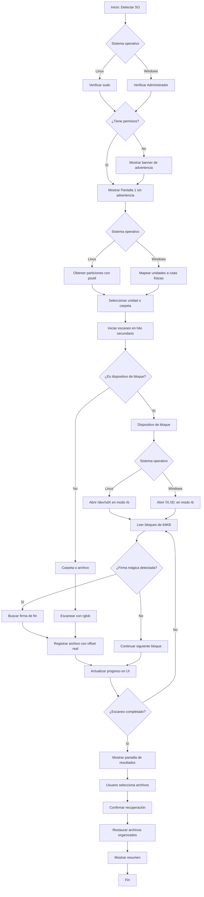

# 🕷️ SpiderRecovery

> Aplicación de escritorio multiplataforma (Linux Fedora y Windows) que recupera archivos eliminados mediante escaneo profundo (File Carving) basado en firmas mágicas.

[](VERSION)
[](https://fedoraproject.org/)
[](https://www.python.org/)

---

## ✨ Características

- **🎨 Interfaz moderna**: Diseño oscuro con CustomTkinter, esquinas redondeadas y layout espacioso
- **🔍 Escaneo profundo real (File Carving)**: Algoritmo basado en firmas mágicas para identificar archivos por su contenido
- **💽 Acceso a dispositivos de bloque**: Lectura directa de particiones en modo binario
- **🖥️ Multiplataforma**: Compatible con Linux (Fedora) y Windows
- **⚡ Ejecución en segundo plano**: Threading real con bloques de 64KB para uso eficiente de RAM
- **📊 Progreso en tiempo real**: Barra animada, contadores de archivos, velocidad y tiempo transcurrido
- **⏸️ Controles de escaneo**: Pausar, reanudar y cancelar en cualquier momento
- **📂 Explorador de doble panel**: Árbol por tipo de archivo y carpeta original + lista detallada con checkboxes
- **💾 Recuperación selectiva**: Elige archivos individuales y recupéralos a una carpeta segura
- **🏥 Indicador de salud**: Evalúa la integridad potencial de cada archivo encontrado
- **🗂️ Detección inteligente de unidades**: Menú desplegable con todas las particiones del sistema
- **📁 Ruta de destino visible**: Campo no editable con la carpeta de destino y botón para cambiarla
- **🔐 Validación de permisos**: Banner de advertencia si no se ejecuta con privilegios elevados

---

## 📋 Requisitos previos

- **Sistema operativo**: Linux (Fedora 38+) o Windows 10/11
- **Python**: 3.10 o superior
- **Gestión de paquetes**: `pip`
- **Permisos**: Se recomienda ejecutar con privilegios elevados (sudo/Administrador)

---

## 🚀 Instalación

### Linux (Fedora)

```bash
# Clonar o descargar el proyecto
cd ~/Aplicaciones
git clone <url-del-repositorio> spiderRecovery
cd spiderRecovery

# Crear entorno virtual
python3 -m venv venv
source venv/bin/activate

# Instalar dependencias
pip install -r requirements.txt
```

### Windows

```powershell
# Clonar o descargar el proyecto
cd %USERPROFILE%\Aplicaciones
git clone <url-del-repositorio> spiderRecovery
cd spiderRecovery

# Crear entorno virtual
python -m venv venv
venv\Scripts\activate

# Instalar dependencias
pip install -r requirements.txt
```

---

## ▶️ Ejecución

### Linux (Fedora)

```bash
# Modo normal (escaneo de carpetas de usuario)
python3 main.py

# Con permisos de administrador (escaneo de dispositivos de bloque)
sudo venv/bin/python3 main.py
```

### Windows

```powershell
# Modo normal (escaneo de carpetas de usuario)
python main.py

# Con permisos de administrador (escaneo de dispositivos físicos)
# Click derecho -> "Ejecutar como administrador"
# O desde PowerShell con privilegios elevados:
python main.py
```

> **Nota**: Para acceder a dispositivos de bloque se requieren privilegios elevados. Si no se ejecuta con permisos de administrador, se mostrará un banner de advertencia.

---

## 🏗️ Arquitectura del proyecto

```
spiderRecovery/
├── main.py                    # Punto de entrada principal
├── VERSION                    # Versión actual de la aplicación
├── README.md                  # Este archivo
├── CHANGELOG.md               # Registro de cambios
├── requirements.txt           # Dependencias Python
├── core/                      # Lógica de negocio
│   ├── __init__.py
│   ├── signatures.py          # Firmas mágicas de tipos de archivo
│   ├── scanner.py             # Motor de File Carving multiplataforma
│   └── recover.py             # Recuperación de archivos
├── ui/                        # Interfaz de usuario
│   ├── __init__.py
│   ├── app.py                 # Ventana principal y navegación
│   ├── screen_select.py       # Pantalla 1: Selección multiplataforma
│   ├── screen_progress.py     # Pantalla 2: Progreso del escaneo
│   └── screen_results.py      # Pantalla 3: Resultados y recuperación
└── assets/
    └── icons/                 # Iconos de la aplicación
```

---

## 🔄 Flujo del escaneo profundo



---

## 🛠️ Tecnologías utilizadas

| Tecnología | Uso |
|------------|-----|
| **Python 3** | Lenguaje principal |
| **CustomTkinter** | Framework UI moderna para Tkinter |
| **psutil** | Detección de particiones y uso de disco |
| **platform** | Detección del sistema operativo |
| **threading** | Ejecución en segundo plano |
| **pathlib** | Manejo de rutas multiplataforma |

---

## 📄 Licencia

Este proyecto es de código abierto bajo licencia [GNU General Public License v3.0](LICENSE).

---

## 🤝 Contribuciones

Las contribuciones son bienvenidas. Por favor, abre un issue o pull request en el repositorio.

---

<div align="center">

**SpiderRecovery** — Recupera lo que creías perdido 🕷️

</div>
